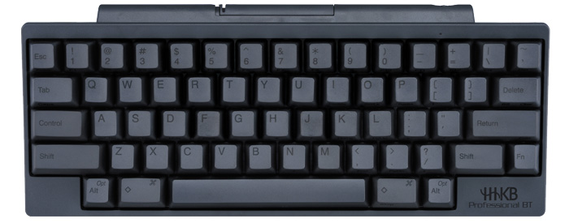

# HHKB

Happy Hacking Keyboard Professional BT

英語配列 無刻印モデル PD-KB600BN

[Happy Hacking Keyboard | 製品ラインナップ | PFU](https://www.pfu.fujitsu.com/hhkeyboard/lineup/pdkb600bn.html)

マニュアル

https://www.pfu.fujitsu.com/hhkeyboard/manual/P3PC-5931-02.pdf

レイアウト

## ペアリング

- Fn q でペアリングモードとなりペアリングができた。
  - ただし、PINの数値が表示されないことがあり、その場合は以下を参照
  - [Windows10パソコンでPINの入力ができません。 | Happy Hacking Keyboard よくあるご質問](https://faq.pfu.jp/faq/show/3107?category_id=143&site_domain=hhkb)
- Windowsの日本語オプションでキーボードレイアウトを英語キーボードとする。

- [HHKB Hybridモデル 複数台でのペアリング方法 – ごりゅご.com](https://goryugo.com/20200106/hhkb-hybrid-pearing/)
  - Fn Ctrl 数値で複数台の切り替えが可能とのことだが再現しなかった

## ディップスイッチ

変更後は再起動が必要

- SW1をONとする : Lite拡張モードとなる
  - ◇がWindowsボタンとなる
- SW3をONとする : DeleteがBSとなる
- SW4をONとする : 左◇がFnとなる

## Fnキー

マニュアルを参照。よく使うものは以下。

|   キー    |    動作     |   備考   |
| --------- | ----------- | -------- |
| Shift Tab | CapsLock    | ` でもOK。[loftkun/key-settings](https://github.com/loftkun/key-settings#windows)も併用している。 |
| [;'/      | 矢印        |          |
| `         | Delete      |          |
| k         | Home        |          |
| ,         | End         |          |
| i         | PrintScreen |          |

## 日本語入力

- [英語配列で半角と全角の切り替え(英数入力とローマ字入力等の切り替え)をするにはどうすればよいですか | Happy Hacking Keyboard よくあるご質問](https://faq.pfu.jp/faq/show/2604?category_id=143&site_domain=hhkb#:~:text=%E3%80%8Calt%E3%80%8D%E3%82%AD%E3%83%BC%E3%82%92%E6%8A%BC%E3%81%97%E3%81%AA%E3%81%8C%E3%82%89,%E5%8F%B3%E7%AB%AF%EF%BC%89%E3%82%AD%E3%83%BC%E3%82%92%E6%8A%BC%E3%81%97%E3%81%BE%E3%81%99%E3%80%82&text=%E3%80%8Ccommand%E3%80%8D%2B%E3%80%8C%E3%82%B9%E3%83%9A%E3%83%BC%E3%82%B9%E3%80%8D,%E3%81%AE%E5%88%87%E3%82%8A%E6%9B%BF%E3%81%88%E3%81%8C%E3%81%A7%E3%81%8D%E3%81%BE%E3%81%99%E3%80%82)
  - defaultではこう。
- [Happy Hacking Keyboard | ダウンロード | PFU](https://happyhackingkb.com/jp/download/index.html)
  - 公式のキーマップ変更ツール
    - **Bluetooth接続では利用できません。**
- [英語配列のHHKBで全角/半角切り替えする方法](https://the-tanaka.com/archives/2822)
  - [AutoHotkey](https://www.autohotkey.com/)を使って実現
- [【HHKB】英語キーボードの右Altキーに［全角／半角］キーを割り当てる | エヴァコレ雑記](https://evacore.info/hardware-hhkb-alt/)
  - レジストリをいじって実現
- [HHKB英語配列にしたらキー配列設定に試行錯誤した話。](https://blog.k-san.info/hhkb-key-mapping)
  - [WindowsのAlt空打ちで日本語入力(IME)を切り替えるツールを作った - karakaram-blog](https://www.karakaram.com/alt-ime-on-off/)
     - [Releases · karakaram/alt-ime-ahk](https://github.com/karakaram/alt-ime-ahk/releases) を使って実現

